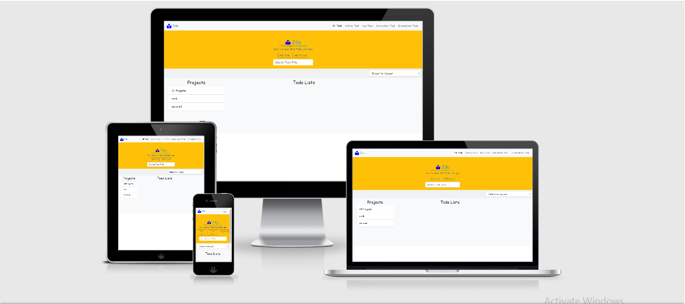

# 2DU

> 2du is a todo app designed using HTML,CSS and Javascript.



The project follows the guideline of [the odin project](https://theodinproject.com/courses/javascript/lessons/todo-list?ref=lnav) to build a todo app using javascript for DOM manipulation and interaction. It uses javascript objects and functions. It uses webpack. It also uses Bootstrap for user interface design.

It demonstrates the use of Object Oriented Programming in javascript.

## Technology Used

- HTML

  - Semantic HTML

- CSS

  - CSS Flexbox

- [Bootstrap framework](https://getbootstrap.com/)

- Javascript

- [Webpack](https://webpack.js.org/)

- [stylint](https://stylelint.io/)

- [NPM](https://www.npmjs.com/)

## Live Demo

[2du](https://adejam.github.io/2du/index.html)

### Development (Running locally)

- Clone the project

```bash
git clone https://github.com/adejam/2du.git

```

- Install Dependencies

```bash
npm install
```

To run StyleLint by itself, you may run the lint task:

```bash
npm run lint:check
```

Or to automatically fix issues found (where possible):

```bash
npm run lint
```

You can also check against Prettier:

```bash
npm run format:check
```

and to have it actually fix (to the best of its ability) any format issues, run:

```bash
npm run format
```

You can also check against HTML Validator:

```bash
npm run html-validator
```

You can also build with webpack:

```bash
npm run build
```

## Style Guides

- [CSS Style Guide](http://udacity.github.io/frontend-nanodegree-styleguide/css.html)
- [HTML Style Guide](http://udacity.github.io/frontend-nanodegree-styleguide/index.html)
- [JavaScript Style Guide](http://udacity.github.io/frontend-nanodegree-styleguide/javascript.html)
- [Git Style Guide](https://udacity.github.io/git-styleguide/)

## 👤 Author

### Adeleye Jamiu

- Github: [@adejam](http://github.com/adejam)
- Twitter: [@adeleye_oj](https://twitter.com/Adeleye_oj)
- LinkedIn: [@adeleye-jamiu](https://linkedin.com/in/adeleye-jamiu)

## 🤝 Contributing

Contributions, issues and feature requests are welcome!

Feel free to check the [issues page](../../issues).

## Show your support

Give a ⭐️ if you like this project!

## Acknowledgments

- [@bolah2009](http://github.com/bolah2009)

- [The Odin ProJect](https://theodinproject.com/courses/javascript/lessons/todo-list?ref=lnav)

- [W3c](https://www.w3.org/)

- [MDN](https://developer.mozilla.org/)

- [w3schools](https://www.w3schools.com/)

- [Bootstrap framework](https://getbootstrap.com/)

## 📝 License

[MIT licensed](./LICENSE).
